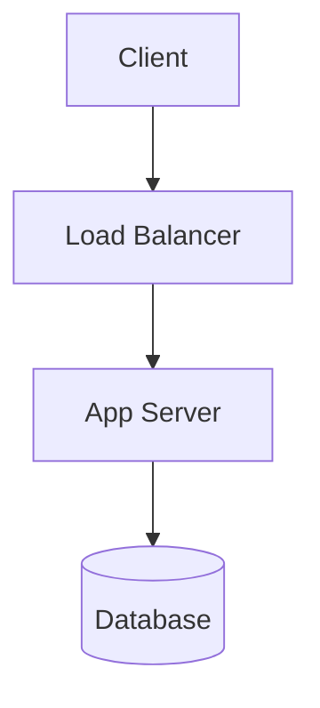
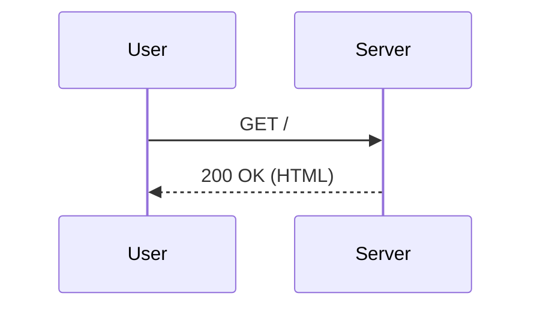

# GFM “All-the-Things” Test File for `react-native-enriched-markdown`
<!--
This file exercises most Markdown features supported on GitHub.com:
CommonMark + GFM extensions + a handful of GitHub-specific niceties
(mermaid, math, callouts, task lists, autolinks, mentions, issue/PR/commit references, etc.).
-->

> [!TIP]
> View this in a GitHub repo to see repo-aware features (mentions, #123 linking, SHA linking)
> and interactive items (task lists, details/summary).

## Table of Contents
- [Headings](#headings)
- [Paragraphs & Line Breaks](#paragraphs--line-breaks)
- [Emphasis](#emphasis)
- [Links & Autolinks](#links--autolinks)
- [Images](#images)
- [Blockquotes](#blockquotes)
- [Lists](#lists)
- [Task Lists](#task-lists)
- [Tables](#tables)
- [Code & Syntax Highlighting](#code--syntax-highlighting)
- [Diff & Patch Blocks](#diff--patch-blocks)
- [Footnotes](#footnotes)
- [Emoji & Kaomoji](#emoji--kaomoji)
- [Mentions, Issues, PRs, SHAs](#mentions-issues-prs-shas)
- [HTML in Markdown](#html-in-markdown)
- [Admonitions (Callouts)](#admonitions-callouts)
- [Details / Summary (Collapsible)](#details--summary-collapsible)
- [Mathematics (KaTeX)](#mathematics-katex)
- [Diagrams (Mermaid)](#diagrams-mermaid)
- [Escapes & Entities](#escapes--entities)
- [Horizontal Rules](#horizontal-rules)
- [Anchors & Heading IDs](#anchors--heading-ids)
- [Definition List (GitHub may change)](#definition-list-github-may-change)
- [Miscellaneous](#miscellaneous)
- [Reference Definitions](#reference-definitions)

---

## Headings
# H1
## H2
### H3
#### H4
##### H5
###### H6

Trailing hashes are OK:  
### Heading with trailing hashes ###

## Paragraphs & Line Breaks
A normal paragraph. This sentence ends with two spaces to force a line break.  
This is the next line.

Single newline without two spaces does **not** break; you usually need two spaces or `<br>`.<br>Like this.

## Emphasis
*Italic* _Italic also_
**Bold** **Bold also**
***Bold & Italic***
~~Strikethrough~~
**Bold with ~~strikethrough~~ inside**
__Underline__ (via md4cFlags.underline)
<mark>Marked/Highlighted</mark>
H<sub>2</sub>O with <sub>subscript</sub>, and E = mc<sup>2</sup> with <sup>superscript</sup>

## Links & Autolinks
Inline: [GitHub](https://github.com "GitHub Home")  
Reference: [Example][example-ref] and [Relative link to README](./README.md)  
Autolink literal: https://example.com and www.example.org (GFM autolink)  
Angle-bracket autolink: <mailto:octocat@example.com>  
Escaped brackets: \[literal brackets\]

Link with title on image: [](https://octodex.github.com/)

## Images
Inline image: 
Reference image: ![Yaktocat][yaktocat]

Block image (own line):

![Yaktocat][yaktocat]

HTML image with width attribute:<br>


## Blockquotes
> Blockquotes can contain paragraphs,
> lists, and code.
>
> - A list item
> - Another item
>
> > Nested blockquote
>
> ```bash
> echo "Fenced code inside a quote"
> ```

## Lists

Unordered (mixing markers `-`, `*`, `+`):

- Item A
  - Nested A.1
    - Nested A.1.a
* Item B
+ Item C

Ordered (custom start index and nesting):

42. Forty-two
43. Forty-three
    1. Sub-one
    2. Sub-two
0. Zero (auto-numbered as 44 on GitHub)

List with paragraphs and code:

1. This item has a paragraph.

   Additional indented paragraph.

   ```js
   console.log("Code in a list item");
   ```

## Task Lists
- [ ] Top-level unchecked
- [x] Top-level checked
- [ ] Nested tasks
  - [ ] Child 1
  - [x] Child 2
    - [ ] Grandchild
- [ ] _Task with **emphasis** and [link](#links--autolinks)_

> [!NOTE]
> Task lists are interactive on GitHub issues/PRs/comments and in Markdown files on GitHub.com.

## Tables

Basic:

| Animal | Sound |
|-------:|:-----:|
| Cat    | Meow  |
| Dog    | Bark  |
| 🐮     | Moo   |

Aligned, inline code & breaks:

| Column A         | Column B        | Column C |
|:-----------------|:----------------|---------:|
| \`code\`         | **bold**        |      123 |
| line 1<br>line 2 | [link](#tables) |      3.14 |

Table with task list checkboxes:

| Feature        | Done |
|----------------|------|
| Task lists     | [x]  |
| Table breaks   | [ ]  |

## Code & Syntax Highlighting

Inline \`code\` and \``backticks in code`\`.

Indented code block (4 spaces):

    $ echo "Hello from an indented code block"
    $ uname -a

Fenced code block with language hint:

```bash
# Bash / shell
set -euxo pipefail
echo "Hello"
```

```javascript
// JavaScript
function greet(name) {
  console.log(`Hello, ${name}!`);
}
greet("World");
```

```python
def fib(n: int) -> int:
    a, b = 0, 1
    for _ in range(n):
        a, b = b, a + b
    return a
```

Fences with backticks *inside* (use tildes outside):

~~~~
```
Literal triple-backticks inside a code fence.
```
~~~~

## Diff & Patch Blocks

```diff
diff --git a/app.js b/app.js
index 0000001..0ddba11 100644
--- a/app.js
+++ b/app.js
@@ -1,4 +1,6 @@
-const feature = false;
+const feature = true;
+console.log("Feature enabled");
+
 function main() {
-  return null;
+  return "ok";
 }
```

```patch
*** 1,3 ***
--- old.txt
+++ new.txt
@@ -1 +1,3 @@
-Hello world
+Hello world
+Hello again
+Goodbye
```

## Footnotes
Here is a footnote reference,[^1] and another one with a longer label.[^long-note]

[^1]: This is the first footnote.
[^long-note]: This is a longer footnote with **markdown** and a link to [GitHub](https://github.com).

## Emoji & Kaomoji
Emoji shortcodes: :tada: :shipit: :+1: :warning: :sparkles:  
Unicode emoji: 🎉 🚀 👍 ⚠️ ✨  
Kaomoji: (╯°□°）╯︵ ┻━┻  ┬─┬ ノ( ゜-゜ノ)

## Mentions, Issues, PRs, SHAs
- User mention: @octocat
- Team mention (org/team): @github/docs
- Issue reference: #123
- Cross-repo reference: github/docs#456
- Full URL to an issue: https://github.com/github/markup/issues/999
- Commit SHA (short and long): d34db33, d34db33fd34db33fd34db33fd34db33fd34db33f

> These auto-link if this file is in a GitHub repo where the references exist.

## HTML in Markdown

Keyboard keys: Press <kbd>Ctrl</kbd> + <kbd>C</kbd> to copy.  
Abbreviation: <abbr title="GitHub Flavored Markdown">GFM</abbr>  
Inserted/Deleted: <ins>added text</ins> and <del>deleted text</del>  
Sup/Sub: H<sub>2</sub>O, x<sup>2</sup>  
Inline raw HTML block:

<div style="padding:0.5em; border:1px solid #ddd; border-radius:8px;">
  <strong>HTML container</strong><br>
  HTML is sanitized on GitHub, so only a safe subset is allowed.
</div>

## Admonitions (Callouts)

> [!NOTE]
> This is a **Note** callout.

> [!TIP]
> This is a **Tip** callout.

> [!IMPORTANT]
> This is an **Important** callout.

> [!WARNING]
> This is a **Warning** callout.

> [!CAUTION]
> This is a **Caution** callout.

## Details / Summary (Collapsible)

<details>
  <summary>Click to expand details</summary>

  You can put **Markdown** inside a *details* element,
  including lists and code:

  - Bullet one
  - Bullet two

  ```json
  { "expanded": true }
  ```
</details>

## Mathematics (KaTeX)

Inline: $E = mc^2$, $\LaTeX$ style fractions $ \frac{a}{b} $, and sets $\mathbb{R}$.

Display:

$$
\int_{0}^{\infty} x^{n-1} e^{-x} \, dx = \Gamma(n)
$$

Matrices:

$$
A = \begin{bmatrix}
1 & 2 \\
3 & 4
\end{bmatrix}
$$

> Math rendering is supported on GitHub.com via KaTeX.

## Diagrams (Mermaid)





## Escapes & Entities

Escape a literal asterisk: \*  
Escape a backslash: \\  
HTML entities: &copy; &rarr; &amp; &nbsp;  
Code span with backticks: ``Use `code` with care``

## Horizontal Rules

Three or more of `-`, `*`, or `_` on their own lines:

---
***
___

## Anchors & Heading IDs

GitHub auto-generates heading slugs. Link back to [the top](#gfm-allthethings-test-file).

HTML anchors also work:

<a name="custom-anchor"></a>
Jump to a custom anchor worked if you clicked a link here.

## Definition List (GitHub may change)

Term 1
: Definition 1

Term 2
: Definition with **markdown** and a list
: - subpoint A
: - subpoint B

> Some Markdown processors support definition lists. GitHub support may evolve.

## Miscellaneous

- Relative image link (may not render outside a repo): ``
- Escaped pipe in table cells (`\|`)
- Heading with emoji in text: ### Features :sparkles:
- HTML comment (won’t render): <!-- This is a comment -->
- URL in code shouldn’t autolink: `https://not-a-link.example`

---

## Reference Definitions

[example-ref]: https://example.com "Example Domain"
[yaktocat]: https://octodex.github.com/images/yaktocat.png "The Yaktocat"
